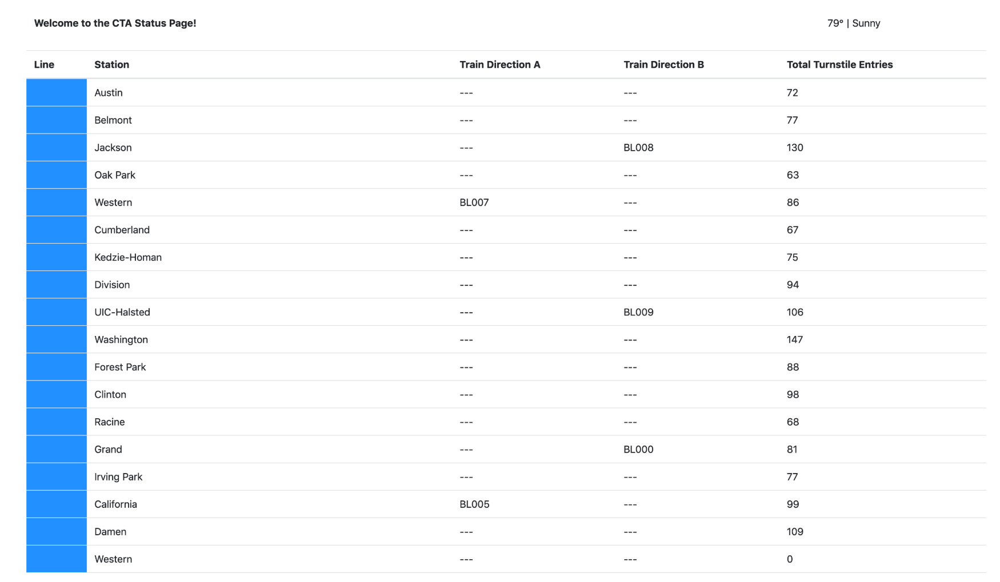

Using public data from the Chicago Transit Authority construct an event pipeline around Kafka that allows us to simulate and display the status of train lines in real time.

Our architecture will look like so:

We will be able to monitor a website to watch trains move from station to station. So a sample static view of the website page you create might look like this:

# Running the Simulation

## To run the producer:

    cd producers
    python simulation.py

## To run the Faust Stream Processing Application:

    cd consumers
    faust -A faust_stream worker -l info

## To run the KSQL Creation Script:

    cd consumers
    python ksql.py

## To run the consumer:

    cd consumers
    python server.py
